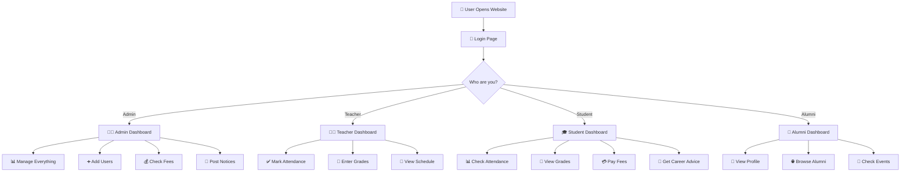
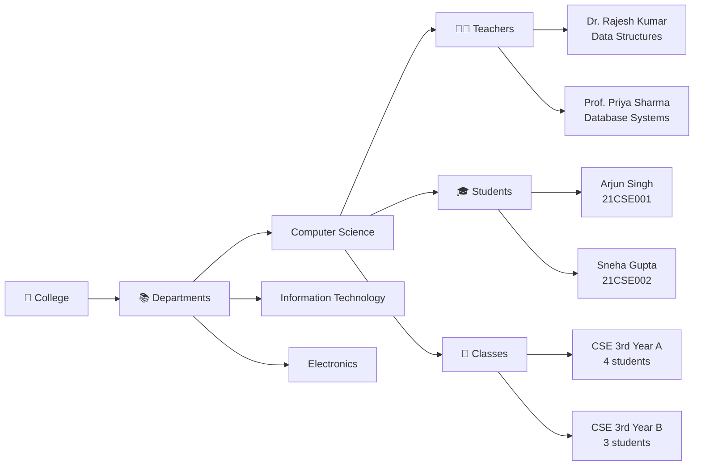
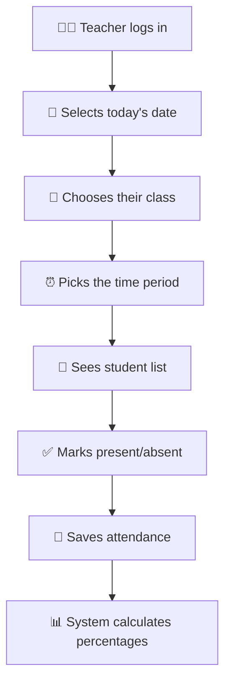
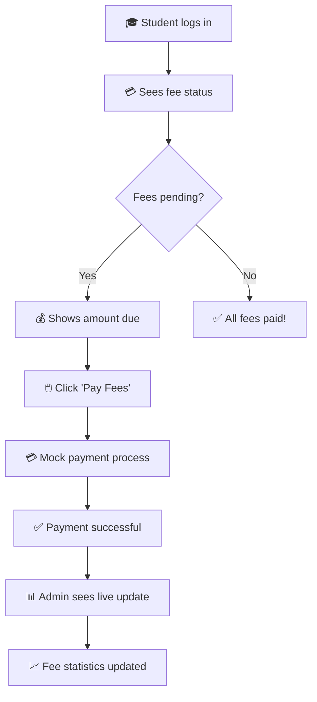
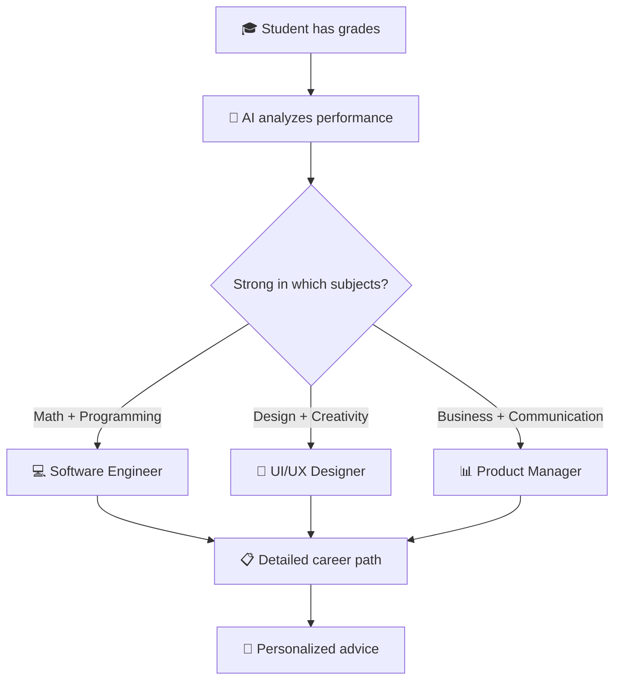

# 🎓 College ERP System - A Simple Guide

## What is this?

Imagine you're running a college and need to keep track of everything - students, teachers, classes, grades, attendance, and fees. Instead of using paper files and spreadsheets, this **College ERP System** is like a digital assistant that helps manage all these things in one place!

**ERP** stands for "Educational Resource Planning" - it's basically a smart system that helps colleges organize and manage their daily operations.

---

## 🌟 What Can This System Do?

Think of this system as having **4 different types of users**, each with their own special dashboard:

### 👨‍💼 **Admin (The Boss)**
- Can see everything happening in the college
- Add new teachers and students to the system
- Check how much fees students have paid
- Post important announcements
- Approve alumni (graduated students) to join the alumni network

### 👨‍🏫 **Teachers**
- Mark attendance for their classes (who came to class today?)
- Enter grades/marks for students
- View their weekly teaching schedule
- See which students are in their classes

### 🎓 **Students**
- Check their attendance (how many classes did I attend?)
- View their grades and overall performance
- See their weekly class schedule
- Pay college fees online
- Get AI-powered career suggestions based on their grades
- Read college announcements

### 👥 **Alumni (Graduated Students)**
- Keep in touch with their college
- View other alumni profiles
- Check alumni events and reunions

---

## 🔄 How Does It Work? (Simple Flowchart)

---

## 🎯 Real-Life Example: A Day in the College

Let's say it's **Monday morning** at the college:

### **9:00 AM - Teacher's Perspective**
1. **Dr. Rajesh Kumar** (Computer Science teacher) logs in
2. He sees his schedule: "Data Structures class with CSE 3rd Year A"
3. He goes to class, teaches, then comes back to mark attendance
4. He clicks on his class, selects today's date, and marks which students were present
5. The system automatically calculates attendance percentages

### **10:00 AM - Student's Perspective**
1. **Arjun Singh** (a student) logs in during break
2. He checks his attendance: "85% in Data Structures - Good!"
3. He sees his weekly schedule: "Next class is Database at 11:00 AM"
4. He notices a fee payment reminder and pays ₹25,000 online
5. The system updates his fee status immediately

### **11:00 AM - Admin's Perspective**
1. **System Admin** logs in to check overall college status
2. Sees that ₹25,000 was just paid by Arjun (live update!)
3. Posts a notice: "Mid-term exams start next week"
4. Approves a new alumni registration request

### **12:00 PM - Everyone Sees Updates**
- Students see the exam notice when they log in
- Teachers see updated attendance data
- Fee records are automatically updated
- Everything happens in real-time!

---

## 🏫 College Structure in the System

---

## 📊 How Attendance Works (Step by Step)

This is one of the coolest features! Here's how it works:

### **Step 1: Teacher Marks Attendance**

### **Step 2: Student Sees Results**
- **Arjun attended 17 out of 20 classes = 85% attendance**
- **Color coding**: Green (Good), Yellow (Okay), Red (Poor)
- **Subject-wise breakdown**: Math 90%, Physics 80%, etc.

---

## 💰 Fee Payment System (Simple & Smart)

**Example:**
- **Total Fees**: ₹1,20,000
- **Paid**: ₹85,000
- **Remaining**: ₹35,000
- **One-click payment**: Pay up to ₹25,000 at a time

---

## 🤖 AI Career Recommendations

This is like having a smart counselor!

**Example Output:**
> "Based on your excellent performance in Data Structures (95%) and Database Systems (88%), you'd be great at:
> - Software Development
> - Database Administration  
> - System Architecture
> Here are some companies to consider..."

---

## 📅 Weekly Timetable System

Every student and teacher gets a personalized schedule:

### **Student View - Arjun's Monday**
| Time | Subject | Teacher | Room |
|------|---------|---------|------|
| 9:00-10:00 | Data Structures | Dr. Rajesh Kumar | CS-101 |
| 10:00-11:00 | Database Systems | Prof. Priya Sharma | CS-102 |
| 11:15-12:15 | Software Engineering | Dr. Kiran Joshi | CS-103 |
| 12:15-13:15 | **Lunch Break** | - | - |
| 14:00-15:00 | Data Structures Lab | Dr. Rajesh Kumar | CS-101 |

### **Teacher View - Dr. Rajesh's Monday**
- **9:00 AM**: Teach CSE 3rd Year A (Data Structures)
- **2:00 PM**: Teach CSE 3rd Year A (Data Structures Lab)
- **3:00 PM**: Teach CSE 3rd Year B (Data Structures)

---

## 🔐 How to Use the System (Login Guide)

The system has a beautiful login page where you enter your username and password:

### **Quick Test Accounts:**
- **Admin**: Username: `admin`, Password: `admin123`
- **Teacher**: Username: `rajesh.kumar`, Password: `teacher123`  
- **Student**: Username: `21CSE001`, Password: `student123`
- **Alumni**: Username: `suresh.menon`, Password: `alumni123`

### **Login Process:**
1. Open the website
2. See the beautiful purple login page
3. Enter your username and password
4. Click "Sign In"
5. Get taken to your personalized dashboard!

---

## 🎨 What Makes This System Special?

### **1. Real-Time Updates**
- When a teacher marks attendance, students see it immediately
- When a student pays fees, admin sees the update instantly
- Everything is connected and updates live!

### **2. Smart Design**
- **Colors mean something**: Green = Good, Yellow = Okay, Red = Needs attention
- **Easy to use**: Big buttons, clear text, simple navigation
- **Works everywhere**: Phone, tablet, computer - it adapts!

### **3. Realistic Data**
- **20 students** across different departments
- **8 teachers** with different subjects
- **6 classes** with proper schedules
- **Real college structure** with departments and courses

### **4. Complete Features**
- ✅ Attendance tracking with percentages
- ✅ Grade management and averages
- ✅ Fee payment and tracking
- ✅ Weekly timetables
- ✅ Notice board system
- ✅ AI career guidance
- ✅ Alumni network

---

## 🚀 Why This System is Useful

### **For Colleges:**
- **Save Time**: No more paper registers or manual calculations
- **Reduce Errors**: Automatic calculations mean fewer mistakes
- **Better Communication**: Instant notices and updates
- **Data Insights**: See trends in attendance, fees, performance

### **For Teachers:**
- **Easy Attendance**: Click a few buttons instead of paper marking
- **Grade Tracking**: Enter grades once, see all analytics
- **Schedule Management**: Always know where to be and when

### **For Students:**
- **Stay Informed**: Always know your attendance and grades
- **Easy Payments**: Pay fees online anytime
- **Career Guidance**: Get personalized advice based on performance
- **Never Miss**: See your schedule and important notices

### **For Parents:**
- Students can share their dashboard to show progress
- Transparent fee payment system
- Real-time academic performance tracking

---

## 🎯 The Big Picture

This College ERP System is like having a **smart assistant for the entire college**. It:

1. **Connects Everyone**: Students, teachers, admin, and alumni all in one place
2. **Automates Tasks**: No more manual work for attendance, grades, or fees
3. **Provides Insights**: See patterns and trends in academic data
4. **Saves Time**: What used to take hours now takes minutes
5. **Improves Communication**: Everyone stays updated with real-time information

---

## 🌈 Future Possibilities

This system could grow to include:
- 📱 Mobile app for easier access
- 📧 Email notifications for important updates
- 📊 Advanced analytics and reports
- 🎥 Online class integration
- 📚 Digital library management
- 🏆 Achievement and reward systems

---

## 🎉 Conclusion

The College ERP System is like **upgrading from a bicycle to a car** for college management. It makes everything faster, easier, and more organized. Whether you're a student checking your grades, a teacher marking attendance, or an admin managing the whole college, this system makes life simpler!

**It's not just software - it's a complete digital transformation for educational institutions.** 🚀

---

*Built with ❤️ to make education management simple and effective for everyone!*